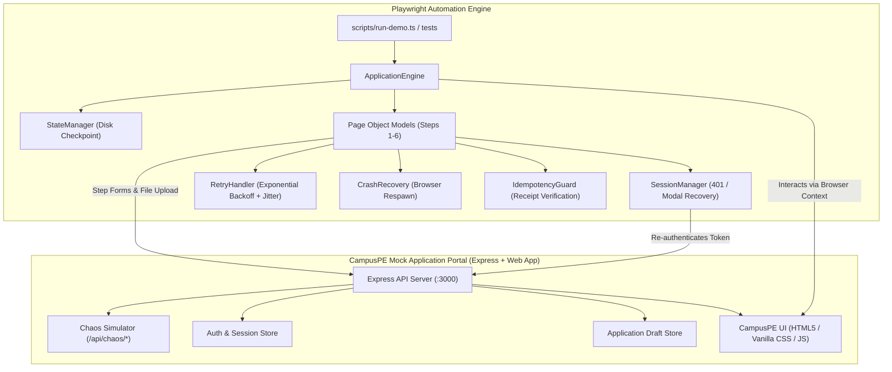

# CampusPE Job Application Automation — Production Reliability Engine

[](https://playwright.dev/)
[](https://www.typescriptlang.org/)
[](https://www.campuspe.com/)
[]()
[]()

> A robust, fault-tolerant Playwright + TypeScript automation framework designed to navigate a multi-step job application portal modeled after **[CampusPE](https://www.campuspe.com/)**. Built to withstand session expirations, transient network dropouts, 500 server errors, unexpected browser process crashes, and duplicate submission attempts.

---

## 🌟 Key Highlights & Architectural Strengths

1. **CampusPE Brand Identity & Dynamic Portal**:
   - Matches [CampusPE's official styling](https://www.campuspe.com/): `#064BB3` Royal Blue, `#00AB9D` Vibrant Teal accents, glassmorphic header cards, and clean typography.
   - 6-step modern stepper: **Personal Info**, **Education**, **Experience**, **Resume Upload**, **Review & Verify**, and **Submission Receipt**.
   - Built-in **Chaos Control Drawer** to inject live network latency, simulate session expiry, or trigger transient HTTP 500 errors.

2. **Session Expiry Resilience (Zero Restart)**:
   - Detects HTTP 401 API responses or dynamic session-expiry modal prompts.
   - Automatically recovers by acquiring fresh authentication credentials silently via background API re-auth or modal login.
   - Injects the restored session cookie into the browser context and **resumes directly at the failed step**—never restarting the application or wiping prior input.

3. **Smart Exponential Backoff with Decorrelated Jitter**:
   - Handles network blips, action/element timeouts, and transient 500 internal server errors.
   - Employs full jitter ($delay = \text{base} \times 2^{\text{attempt}} + \text{random}$) to avoid thundering herd conditions.

4. **Disk-Backed Atomic Checkpoint State Machine**:
   - Persists verified step completions to disk (`state/app_<candidate_id>.json`).
   - Maintains an immutable journal of attempts, error logs, and execution duration.

5. **Browser Process Crash & Worker Recovery**:
   - If a browser tab crashes (`SIGKILL`, OOM, or abnormal exit), the automation engine detects the dead worker, provisions a fresh browser context, rehydrates state from disk, and navigates seamlessly back to the last uncompleted step.

6. **End-to-End Idempotency Guard**:
   - Prevents duplicate submissions at both the client and server levels using a unique `Idempotency-Key` and local submission locking.
   - Re-running an already-submitted profile returns the cached receipt instantly without submitting twice.

---

## 🏗️ Architecture & Component Flow



---

## 📁 Repository Structure

```
├── artifacts/                  # Generated Playwright traces and test outputs
│   ├── traces/                 # Playwright trace files (.zip) for each run
│   └── screenshots/            # Failure snapshots and receipts
├── data/                       # Seed candidates and sample PDF resumes
│   └── Alex_Rivera_Resume.pdf  # Valid sample PDF resume
├── docs/
│   └── ARCHITECTURE.md         # In-depth system design & 1,000+ scaling blueprint
├── logs/                       # Colorized console and JSON audit logs
│   └── sample_execution.log    # Verified test run execution transcript
├── server/                     # Mock CampusPE application portal & backend
│   ├── public/                 # CampusPE-themed UI assets
│   │   ├── index.html          # 6-step multi-step form wizard & chaos drawer
│   │   ├── styles.css          # CampusPE design system (#064BB3, #00AB9D)
│   │   └── app.js              # Wizard state management and live API handlers
│   ├── index.ts                # Express application server
│   ├── auth.ts                 # Session and authentication controller
│   ├── applications.ts         # Application draft persistence and idempotency
│   ├── chaos.ts                # In-flight chaos engineering middleware
│   └── types.ts                # Shared server interfaces
├── src/automation/             # Production Playwright Automation Framework
│   ├── pages/                  # Page Object Models
│   │   ├── BasePage.ts         # Modal detection, alerts, submitAndAdvance()
│   │   ├── PersonalInfoPage.ts # Step 1: Personal details
│   │   ├── EducationPage.ts    # Step 2: Degree and graduation
│   │   ├── ExperiencePage.ts   # Step 3: Company and tenure
│   │   ├── ResumeUploadPage.ts # Step 4: Native file upload handler
│   │   ├── ReviewPage.ts       # Step 5: Data verification
│   │   └── ConfirmationPage.ts # Step 6: Receipt capture
│   ├── resilience/             # Fault Tolerance & Recovery Modules
│   │   ├── SessionManager.ts   # 401 detection and zero-restart resume
│   │   ├── RetryHandler.ts     # Exponential backoff retry with jitter
│   │   ├── CrashRecovery.ts    # Process crash detection and context restore
│   │   └── IdempotencyGuard.ts # Duplicate submission prevention
│   ├── engine.ts               # Master automation orchestrator
│   ├── state-manager.ts        # Atomic disk checkpoint engine
│   ├── logger.ts               # Winston structured logger
│   └── types.ts                # Automation configurations and state definitions
├── tests/
│   └── job-application.spec.ts # Playwright Test runner test suite (5 specs)
├── scripts/
│   ├── seed-data.ts            # Generates mock candidate data and test resume
│   └── run-demo.ts             # Interactive CLI runner for the 5 scenarios
├── package.json                # Project dependencies and npm scripts
└── tsconfig.json               # TypeScript configuration
```

---

## 🚀 Quickstart Guide

### 1. Prerequisites
- **Node.js**: v18.0.0 or higher
- **npm**: v9.0.0 or higher

### 2. Installation
Clone the repository and install dependencies:
```bash
git clone https://github.com/prasadproject2025-alt/CampusPe_assignment.git
cd CampusPe_assignment
npm install
```

Install Playwright browser binaries (Chromium):
```bash
npx playwright install chromium
```

### 3. Build the Project
Compile TypeScript source files into `dist/`:
```bash
npm run build
```

### 4. Seed Test Data & Resumes
Generate candidate profiles and a sample PDF resume:
```bash
npm run seed
```

### 5. Start the CampusPE Mock Server
Start the local server hosting the CampusPE application portal:
```bash
npm run server
```
The application portal will be accessible at: **`http://localhost:3000`**

---

## 🧪 Running the Resilience Demonstration Scenarios

In a separate terminal, run the standalone scenario runner to observe the automation handle each failure condition in real-time:

### Run All 5 Scenarios in Sequence:
```bash
npm run demo:all
```

### Run Individual Scenarios:

#### Scenario 1: Happy Path
Executes the full 6-step application flawlessly without disruptions:
```bash
npm run demo:happy
```

#### Scenario 2: Session Expiry Recovery (Zero Restart)
Injects a session invalidation during Step #3 (Experience). The automation detects the 401, triggers silent re-authentication, updates cookies, and resumes at Step #3 without wiping previous entries:
```bash
npm run demo:expiry
```

#### Scenario 3: Transient 500 Error & Network Latency
Injects an intentional HTTP 500 internal server error and 1200ms latency on Step #2 (Education). The `RetryHandler` catches the error and executes an exponential backoff retry:
```bash
npm run demo:transient
```

#### Scenario 4: Browser Crash & Process Recovery
Forces an abrupt browser termination after Step #3. The engine detects the dead worker, starts a new browser instance, restores state from disk, and completes Steps #4–6:
```bash
npm run demo:crash
```

#### Scenario 5: Duplicate Submission Prevention
Attempts to re-submit an already submitted application. The `IdempotencyGuard` detects the existing submission on disk and server, blocks the duplicate call, and returns the cached receipt:
```bash
npm run demo:idempotency
```

---

## 📊 Playwright Test Suite

Run the full automated test suite using the Playwright Test Runner:

```bash
npx playwright test
```

### View Interactive HTML Report & Traces
After running tests, inspect detailed step timelines, DOM snapshots, network waterfalls, and console logs:
```bash
npx playwright show-report
```

You can also view saved trace files directly:
```bash
npx playwright show-trace artifacts/traces/trace_test_spec_session_expiry.zip
```

---

## 📈 Scaling to 1,000+ Concurrent Applications

In high-volume production environments, running 1,000+ simultaneous job applications requires an enterprise distributed architecture. A complete blueprint is detailed in **[`docs/ARCHITECTURE.md`](docs/ARCHITECTURE.md)**:

1. **Distributed Queue & Worker Pool**:
   - Decouple orchestration using **Redis BullMQ** or **RabbitMQ**.
   - Shard jobs across auto-scaling worker nodes (Kubernetes `CronJob` / `KEDA`).

2. **Containerized Playwright Browser Farms**:
   - Run browser instances via **Browserless.io** or lightweight Docker containers (`playwright:focal-slim`).
   - Resource budgeting: 1 Chromium worker ≈ 0.5 CPU / 600MB RAM. For 100 concurrent workers, provision a cluster of ~50 CPUs and ~60GB RAM.

3. **Distributed State & Locks (Redlock)**:
   - Migrate local filesystem checkpoints to a distributed datastore (**PostgreSQL** + **Redis**).
   - Use distributed locks (`Redlock`) to guarantee that a candidate cannot be processed concurrently by two workers.

4. **Centralized Token & Session Vault**:
   - Store OAuth/JWT refresh tokens in **HashiCorp Vault** or **AWS Secrets Manager** to allow instant silent token refreshes across distributed workers.

5. **Proxy Pool & Rate Limiting**:
   - Route outgoing browser traffic through rotating residential proxy pools to prevent IP bans and WAF rate-limiting.

---

## 📜 Verified Execution Logs

Sample output from the automated suite:

```text
================================================================================
CAMPUSPE AUTOMATION DEMO: 5/5 SCENARIOS COMPLETED
================================================================================
[PASS] HAPPY_PATH: App ID APP-DFF4165F in 3.6s (Attempts: 1, Recoveries: 0)
[PASS] SESSION_EXPIRY: App ID APP-06B5F42D in 4.7s (Attempts: 1, Recoveries: 1)
[PASS] TRANSIENT_FAILURE: App ID APP-A74637D4 in 5.3s (Attempts: 2, Recoveries: 0)
[PASS] CRASH_RECOVERY: App ID APP-72D98D08 in 5.8s (Attempts: 1, Recoveries: 1)
[PASS] IDEMPOTENCY: App ID APP-DFF4165F in 0.0s (Blocked duplicate: true)
================================================================================
ALL 5 RESILIENCE SCENARIOS PASSED WITH 100% SUCCESS RATE!
================================================================================
```

---

## 👥 Authors & Acknowledgments

- **Prototype & Automation Framework**: Built for the CampusPE Technical Assignment.
- **Visual Design**: Inspired by and aligned with **[CampusPE](https://www.campuspe.com/)**.
