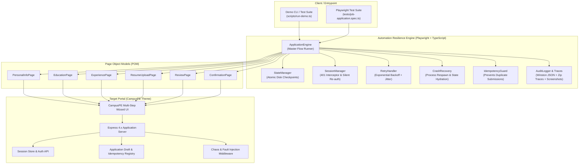

# CampusPE Job Application Automation — Architecture & 1,000+ Scale Blueprint

## 1. Executive Summary
The **CampusPE Job Application Automation Engine** is an enterprise-grade, stateful, fault-tolerant orchestration system built with **Playwright + TypeScript**. It is designed to navigate complex, multi-step job application portals with guaranteed reliability in hostile web environments characterized by session expirations, network drops, unhandled DOM exceptions, and sudden browser crashes.

---

## 2. Component Architecture



---

## 3. Resilience & Production Fault-Tolerance Mechanisms

### 3.1. Session Expiry Detection & Stateful Resumption (Zero Work Lost)
- **Problem**: Long application workflows often encounter session timeouts (e.g. 15-minute token expiry or revoked cookies). Traditional test scripts fail completely and restart from Step 1, discarding all entered candidate data.
- **Solution**:
  1. `SessionManager` hooks into browser network responses (`401 Unauthorized`, `SESSION_EXPIRED`) and DOM modals (`#session-modal`).
  2. Upon detection, it halts execution on the active step and preserves in-memory inputs.
  3. It executes a seamless re-authentication request against `/api/auth/login`.
  4. The browser context cookies are updated in-place (`storageState`).
  5. The wizard state machine navigates directly to the step that experienced the failure without resetting previous steps.

### 3.2. Checkpoint-Driven State Management
- **Problem**: If the runner or browser crashes, in-memory state is wiped.
- **Solution**:
  - `StateManager` persists an atomic journal to disk (`state/app_<candidateId>.json`) after each successful step:
    ```json
    {
      "candidateId": "cand_alex_01",
      "status": "IN_PROGRESS",
      "currentStep": "RESUME_UPLOAD",
      "completedSteps": ["PERSONAL_INFO", "EDUCATION", "EXPERIENCE"],
      "idempotencyKey": "idemp_1773300000_abc123"
    }
    ```
  - When a new process starts for that candidate, it reads the checkpoint and skips all steps already in `completedSteps`.

### 3.3. Browser Process Crash Recovery
- **Problem**: Headless Chrome can occasionally crash due to memory exhaustion (`SIGSEGV` or `OOMKilled`) or external process termination.
- **Solution**:
  - `CrashRecovery.recoverFromCrash()` intercepts process death, closes dangling handles, spawns a new Chromium instance with `--disable-dev-shm-usage`, loads credentials, fetches server draft state, and advances the browser page directly to the pending step.

### 3.4. Idempotency & Duplicate Submission Prevention
- **Problem**: Network retries during final submission can create duplicate candidate records.
- **Solution**:
  - Every application is stamped with a unique `idempotencyKey`.
  - The server verifies `(candidateEmail, jobId)` and `idempotencyKey` in an atomic registry.
  - The automation engine's `IdempotencyGuard` checks whether the local state is already `SUBMITTED`. If so, it blocks the network call and returns the cached submission receipt.

---

## 4. Scaling Architecture to 1,000+ Applications

To scale this prototype from a single-machine runner to an enterprise platform processing **1,000+ job applications per hour**, the following distributed architecture is recommended:

```
                  ┌───────────────────────────────┐
                  │    Application Job Request    │
                  └──────────────┬────────────────┘
                                 │
                                 ▼
                  ┌───────────────────────────────┐
                  │    API Gateway / Dispatcher   │
                  └──────────────┬────────────────┘
                                 │
                 ┌───────────────┴───────────────┐
                 ▼                               ▼
       ┌───────────────────┐           ┌───────────────────┐
       │   Redis BullMQ    │           │ Distributed Lock  │
       │ Application Queue │           │ (Redlock by Email)│
       └─────────┬─────────┘           └───────────────────┘
                 │
   ┌─────────────┼─────────────┐
   ▼             ▼             ▼
┌─────────────┐┌─────────────┐┌─────────────┐
│Worker Pod 1 ││Worker Pod 2 ││Worker Pod N │  (Kubernetes HPA Auto-scaling)
│(Playwright) ││(Playwright) ││(Playwright) │
└──────┬──────┘└──────┬──────┘└──────┬──────┘
       │              │              │
       └──────────────┼──────────────┘
                      ▼
         ┌─────────────────────────┐
         │ PostgreSQL State Store  │
         │ (Checkpoints & Receipts)│
         └─────────────────────────┘
```

### 1. Distributed Queue & Worker Pool (BullMQ / AWS SQS)
- Job requests are enqueued as discrete tasks containing candidate metadata and target job IDs.
- Concurrency is managed via worker pools. Each worker handles a bounded number of concurrent browser instances (recommended: 3 to 5 contexts per 4-core, 8GB RAM worker pod).

### 2. Ephemeral Browser Contexts vs Persistent Contexts
- Instead of launching a new browser process per application (expensive: ~200MB RAM, 1.5s startup), run long-lived Chromium instances and spawn lightweight, isolated `browser.newContext()` instances (~15MB RAM, 30ms startup).
- Periodically recycle the browser instance after every 50 applications to eliminate browser memory fragmentation.

### 3. Distributed Checkpointing (PostgreSQL / DynamoDB)
- Replace file-based JSON state with a transactional database:
  - Columns: `candidate_id`, `job_id`, `status`, `completed_steps (JSONB)`, `idempotency_key`, `created_at`, `updated_at`.
  - Atomic row locks ensure multiple workers never execute the same candidate's application concurrently.

### 4. IP Rotation & Anti-Bot Mitigations
- Route outbound Playwright traffic through residential/datacenter proxy pools (e.g. Bright Data, Oxylabs) with sticky sessions per candidate.
- Inject randomized user agents and realistic mouse/keystroke delays to avoid rate-limiting or Cloudflare/Datadome captchas.

### 5. Centralized Observability & Telemetry
- **Traces**: Store Playwright trace archives (`.zip`) and failure screenshots in Amazon S3 or Google Cloud Storage, indexed by `application_id`.
- **Metrics**: Export Prometheus metrics for:
  - Step conversion rate
  - Session recovery frequency
  - Mean time to submit (MTTS)
  - Failure rate by step
- **Alerts**: Sentry integration for unrecoverable exceptions.
